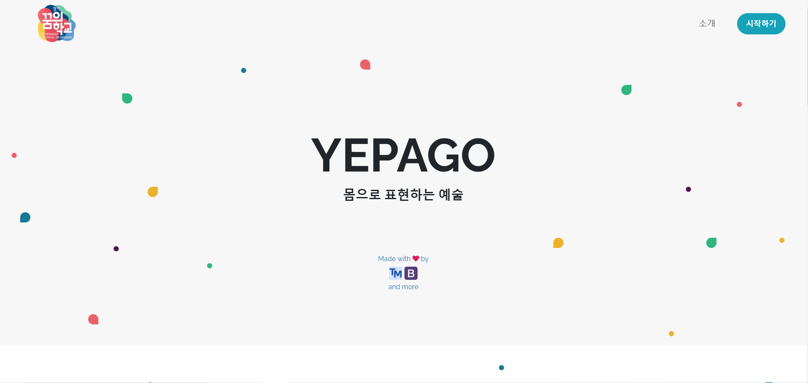
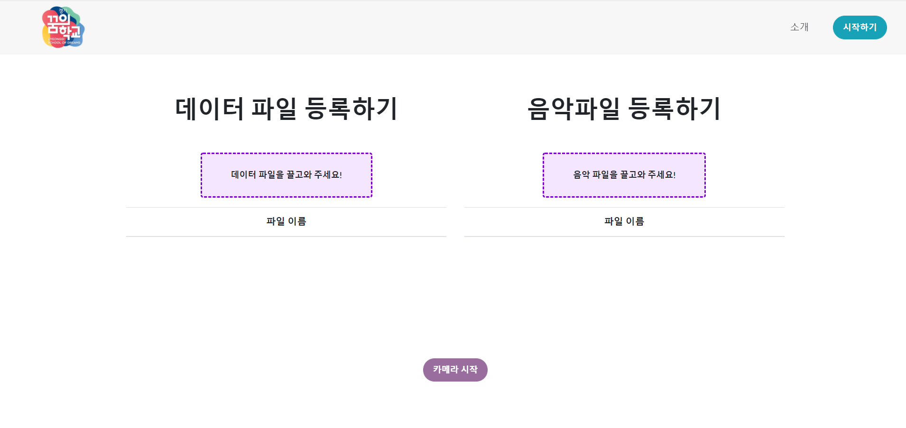
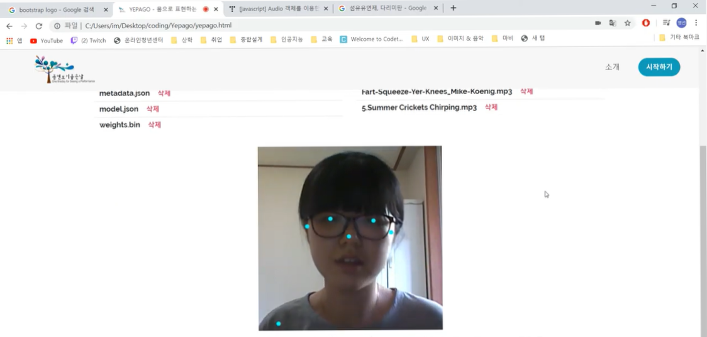

# Yepago_page

꿈의 학교 프로젝트에서 사용할 [홈페이지](https://yepago.netlify.app/) 제작   

BootStrap 프레임워크를 활용한 간단한 홈페이지, 아이를 대상으로한 AI 교육용으로 만들 예정이었으나   
도중 코로나가 2.5로 격상되면서 꿈의 학교 프로젝트 자체가 무산되면서 활용을 하지는 못한 홈페이지이다.   
사용 방법이 꽤 복잡한 편이라서 홈페이지 사용 예시를 [동영상](https://www.youtube.com/watch?v=410IXoYbMwo&ab_channel=%EC%9E%84%EC%98%81%EC%84%A0)으로 찍었다.

### 사용 기술

      

### 활용 사이트

+ https://www.netlify.com/ (웹 사이트 호스팅)    
+ https://teachablemachine.withgoogle.com/ (쉽고 빠른 AI 제작)   
+ https://soundbible.com/ (간단한 효과음 다운로드 사이트)

### 스크린 샷

